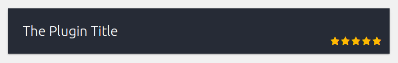
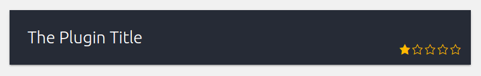

# WP Plugin Rating · Eliasis module

[](https://packagist.org/packages/josantonius/wp_plugin-rating) [](https://packagist.org/packages/josantonius/wp_plugin-rating) [](https://packagist.org/packages/josantonius/wp_plugin-rating) [](https://packagist.org/packages/josantonius/wp_plugin-rating)

[Versión en español](README-ES.md)

Mostrar la calificación del plugin en las páginas de administración de WordPress para plugins desarrollados con Eliasis Framework.

---

- [Instalación](#instalación)
- [Requisitos](#requisitos)
- [Uso](#uso)
- [Imágenes](#imagenes)
- [Contribuir](#contribuir)
- [Licencia](#licencia)
- [Copyright](#copyright)

---

<p align="center"><strong>Echa un vistazo al código</strong></p>

<p align="center">
  <a href="https://youtu.be/cZCLhBgW53A" title="Echa un vistazo al código">
  	
  </a>
</p>

---

### Instalación 

Instalar este módulo en el plugin desde [Composer](http://getcomposer.org/download/). En la carpeta raíz del plugin ejecuta:

    $ composer require josantonius/WP_Plugin-Rating

El comando anterior sólo instalará los archivos necesarios, si prefieres descargar todo el código fuente (incluyendo tests, directorio vendor, archivos sass, documentos...) puedes utilizar:

    $ composer require josantonius/WP_Plugin-Rating --prefer-source

También puedes clonar el repositorio completo con Git:

	$ git clone https://github.com/Josantonius/WP_Plugin-Rating.git

### Requisitos

Este plugin es soportado por versiones de PHP 5.3 o superiores y es compatible con versiones de HHVM 3.0 o superiores.

### Uso

Ejecuta la siguiente acción donde quieras mostrar la clalificación:

```php
<?php
use Josantonius\Hook\Hook;

Hook::doAction('get-wp-plugin-rating', 'wp-plugin-slug');
```

### Imágenes




### Contribuir
1. Comprobar si hay incidencias abiertas o abrir una nueva para iniciar una discusión en torno a un fallo o función.
1. Bifurca la rama del repositorio en GitHub para iniciar la operación de ajuste.
1. Escribe una o más pruebas para la nueva característica o expón el error.
1. Haz cambios en el código para implementar la característica o reparar el fallo.
1. Envía pull request para fusionar los cambios y que sean publicados.

Esto está pensado para proyectos grandes y de larga duración.

### Licencia

Este proyecto está licenciado bajo **licencia GPL-2.0+**. Consulta el archivo [LICENSE](LICENSE) para más información.

### Copyright

2017 Josantonius, [josantonius.com](https://josantonius.com/)

Si te ha resultado útil, házmelo saber :wink:

Puedes contactarme en [Twitter](https://twitter.com/Josantonius) o a través de mi [correo electrónico](mailto:hello@josantonius.com). 